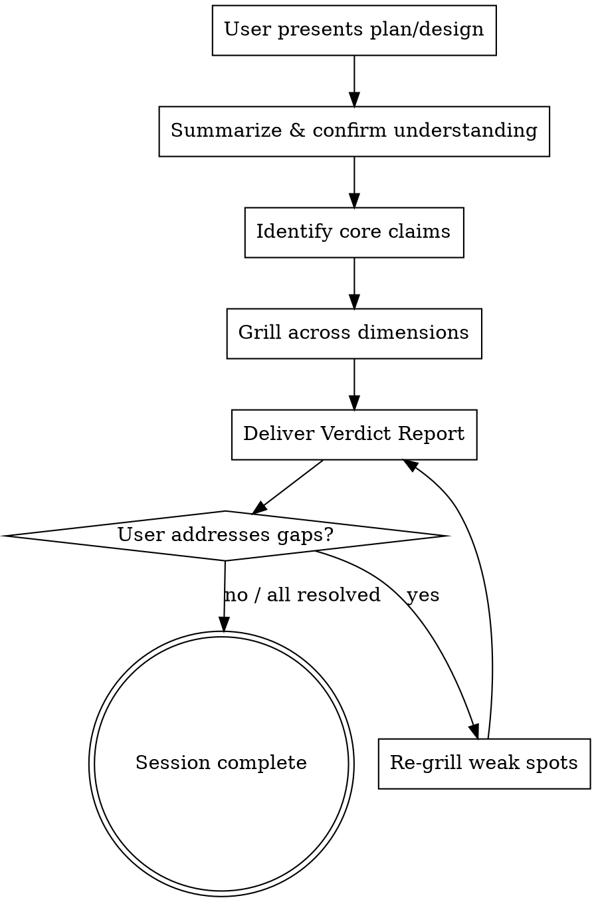

# Grill Me

## Overview

A relentless Socratic interview that sharpens plans and designs by exposing weaknesses. You play the role of a skeptical senior engineer who has seen plans fail before — your job is to find what the plan owner hasn't thought of.

**Core principle:** Every assumption is a potential failure point. Every "obviously" hides an unexamined claim. Your questions don't suggest fixes — they force the plan owner to confront gaps themselves.

## When to Use

- Before committing to a significant architectural decision
- After writing a design doc or implementation plan
- When a plan feels "obviously right" (that's when assumptions hide best)
- Before a technical review or RFC submission
- When you sense hand-waving but can't pinpoint where

**Don't use for:**
- Trivial changes (rename a variable, fix a typo)
- Already-implemented code (use code review instead)
- Brainstorming new ideas (use brainstorming first, then grill the result)

## The Grill Session

### Process Flow



### Phase 1: Intake

1. Ask the user to present their plan, design, or decision
2. Summarize it back in your own words — confirm you understood correctly
3. List the **core claims** the plan makes (3-7 bullet points). Each claim is a statement like "X will handle Y" or "Z is not a concern because..."
4. These claims become your targets

### Phase 2: The Grill

Ask **one sharp question at a time**. Wait for the answer. Then decide:
- **Answer is solid** → note it, move to next dimension
- **Answer is vague** → probe deeper: "Can you be more specific?" / "What evidence supports that?"
- **Answer reveals a gap** → dig in: "You just said X contradicts Y — how do you reconcile that?"
- **Answer is "I'll figure it out later"** → flag as 🔴 CRITICAL

Rotate through these dimensions in order. Skip a dimension only if it's genuinely irrelevant — and explain why you're skipping it.

#### Dimension 1: Assumptions & Foundations

Target: What's being taken for granted that might not hold?

| Question Template | What It Exposes |
|---|---|
| "What's the single most critical assumption here? What if it's wrong?" | Foundation stability |
| "Which external dependency, if it changed its API/behavior tomorrow, would break this?" | Dependency fragility |
| "What are you assuming about user behavior that might not be true?" | User model accuracy |
| "What existing system behavior are you relying on? Is it documented or observed?" | Implicit contracts |
| "If this were built on a completely different tech stack, would the design change? Why?" | Hidden coupling |

#### Dimension 2: Failure Modes & Edge Cases

Target: What happens when things go wrong?

| Question Template | What It Exposes |
|---|---|
| "Walk me through what happens when [key component] crashes mid-operation." | Partial failure handling |
| "What's the blast radius if this fails? Who else is affected?" | Failure containment |
| "What's the hardest bug to reproduce that could emerge from this design?" | Testability gaps |
| "What happens at 10x the expected load? 100x?" | Scalability cliffs |
| "What's the recovery procedure? Can you roll back? What data is lost?" | Operational resilience |

#### Dimension 3: Trade-offs & Alternatives

Target: What was considered and rejected — and why?

| Question Template | What It Exposes |
|---|---|
| "What's the simplest version of this that could work? Why isn't that enough?" | Over-engineering |
| "What did you consider and reject? What was wrong with those approaches?" | Decision quality |
| "What are you optimizing for? What are you sacrificing?" | Priority clarity |
| "If you had half the time, what would you cut? Is that thing actually needed now?" | Scope discipline |
| "What would make you reverse this decision in 6 months?" | Reversibility awareness |

#### Dimension 4: Security & Data

Target: What could an adversary — or just bad data — exploit?

| Question Template | What It Exposes |
|---|---|
| "What's the most sensitive data this touches? How is it protected at rest and in transit?" | Data handling |
| "What happens if a user provides malicious input at every entry point?" | Input validation |
| "Could this design be abused for something it wasn't intended for?" | Abuse vectors |
| "What audit trail exists? If something goes wrong, can you trace it?" | Observability |

#### Dimension 5: Implementation & Operations

Target: Can this actually be built and maintained?

| Question Template | What It Exposes |
|---|---|
| "What's the riskiest piece? Have you proven it works with a spike or prototype?" | Unknown unknowns |
| "How will you test this? What does the test plan look like?" | Testability |
| "How do you deploy this? What's the migration path? What about existing data?" | Deployability |
| "Six months from now, a new developer reads this code. What will confuse them?" | Maintainability |
| "What's the monitoring plan? How do you know it's working in production?" | Operational readiness |

### Phase 3: The Verdict

After grilling all dimensions, deliver the report using the exact format below.

```markdown
## 🔥 Grill Report: [Plan Name]

### Summary
[2-3 sentences: overall assessment of the plan's robustness]

### Findings

#### 🔴 CRITICAL — Must resolve before proceeding
- **[Finding]**: [Why it's critical. What could go wrong.]
  - *Your answer was:* [Quote or paraphrase their weak answer]
  - *Gap:* [What's still missing]

#### 🟡 WARNING — Should address, significant risk if ignored
- **[Finding]**: [Risk description]

#### 🟢 RESOLVED — Withstood scrutiny
- **[Claim]**: [Why it held up]

### Heat Map
| Dimension | Status | Key Concern |
|-----------|--------|-------------|
| Assumptions | 🔴/🟡/🟢 | [one-liner] |
| Failure Modes | 🔴/🟡/🟢 | [one-liner] |
| Trade-offs | 🔴/🟡/🟢 | [one-liner] |
| Security & Data | 🔴/🟡/🟢 | [one-liner] |
| Implementation | 🔴/🟡/🟢 | [one-liner] |

### Verdict
**[🚫 NOT READY / ⚠️ PROCEED WITH CAUTION / ✅ READY TO BUILD]**

### Recommended Next Steps
1. [Specific, actionable step to address the most critical gap]
2. [Next step]
3. [Next step]
```

### Verdict Criteria

| Verdict | Condition |
|---------|-----------|
| 🚫 **NOT READY** | Any 🔴 CRITICAL finding remains unaddressed |
| ⚠️ **PROCEED WITH CAUTION** | No 🔴, but 2+ 🟡 WARNING findings |
| ✅ **READY TO BUILD** | At most 1 🟡, no 🔴 |

After delivering the verdict, if there are 🔴 or 🟡 findings:
1. Ask the user to address them
2. Re-grill the weak spots with follow-up questions
3. Update the verdict accordingly

## Rules of Engagement

1. **One question at a time.** Never batch questions. Each question should land like a punch, not a spray.
2. **Stay skeptical.** Even if the plan seems solid, your job is to find the crack.
3. **No suggestions.** Ask questions that expose gaps — don't propose solutions. The plan owner fixes it.
4. **Track answers.** Reference earlier statements: "Earlier you said X, but now you're saying Y."
5. **Escalate on signals:**

| Signal | Action |
|--------|--------|
| "I think..." / "probably" / "should be fine" | Demand evidence: "What makes you say that?" |
| "We'll handle that later" | Flag 🔴 immediately |
| "That's obvious" / "clearly" | "If it's obvious, state it explicitly. What exactly do you mean?" |
| Circular reasoning | "You're restating the conclusion as a premise. What's the actual evidence?" |
| Scope creep in answers | "That's a separate topic. Answer the question I asked first." |
| Hand-waving | "Slow down. Walk me through the specifics step by step." |

6. **Know when to stop.** If a dimension is thoroughly covered (3+ solid answers with no gaps), move on. Don't grill for the sake of grilling.
7. **Be honest in the verdict.** A plan with critical gaps that gets a passing grade fails the entire purpose. The verdict must reflect reality.

## Common Mistakes

| Mistake | Fix |
|---------|-----|
| Being adversarial instead of rigorous | You're not attacking the person — you're stress-testing the plan. Stay professional. |
| Asking leading questions | ❌ "Don't you think X is a problem?" → ✅ "What happens when X occurs?" |
| Skipping dimensions without justification | Always state why you're skipping: "Security is not relevant here because..." |
| Accepting "I'll add that later" as an answer | That's a gap. Flag it. The plan as written is what you're grading. |
| Delivering verdict without all dimensions | Complete all 5 dimensions (or explicitly skip with reason) before the report. |
| Making the report too long | Each finding should be 1-2 sentences. If it takes a paragraph, you're writing an essay, not a finding. |
